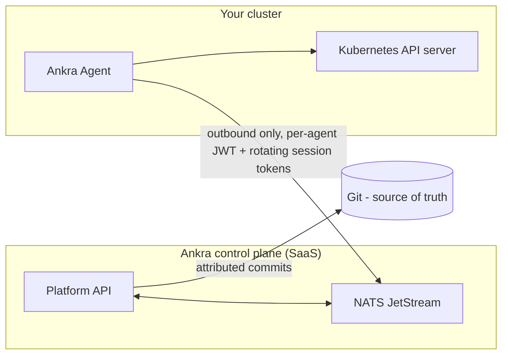

This page is the starting point for evaluating Ankra's security posture. It explains the trust model between the SaaS control plane and your clusters, is deliberately honest about the agent's privileges and what constrains them, and links to the canonical page for each control.

---

## Trust model

Ankra is a SaaS control plane; the work inside your cluster is done by the [Ankra Agent](/concepts/cluster-agent). The agent makes **outbound-only** connections over NATS JetStream, authenticating with per-agent JWT credentials and rotating session tokens. Ankra never needs inbound network access to your cluster and there are no inbound ports to open. Desired state lives in Git - a repository you control is the source of truth, and the platform reconciles clusters towards it.

- **Outbound only** - the agent initiates every connection; nothing on Ankra's side can reach into your network. See [Network Requirements](/concepts/cluster-agent#network-requirements) for the exact endpoints.
- **Per-agent identity** - each agent holds its own JWT credentials, and session tokens rotate rather than living forever.
- **Git is the source of truth** - cluster definitions, Stacks, and add-on configuration are committed to your repository, so every change is diffable and revertable. See [GitOps](/concepts/gitops).

---

## The agent's privileges, honestly

The agent pod is hardened: it runs as **non-root**, with a **read-only root filesystem**, **all Linux capabilities dropped**, and **seccomp `RuntimeDefault`**. It also runs with a **cluster-admin service account** - that is what lets Ankra deploy add-ons, reconcile Stacks, and proxy authenticated `kubectl` for the whole cluster. We state this plainly rather than hiding it, because any tool that manages arbitrary workloads needs equivalent reach.

What constrains that privilege:

- **Draft, approval, commit** - every AI-proposed write becomes a draft that a human approves before it is applied and recorded as an attributed Git commit. The AI never mutates a cluster directly.
- **Drift detection with guardrails** - reconciliation runs inside sync windows and prune guards, so Ankra converges clusters towards Git instead of making surprise deletions.
- **Per-release lease serialisation** - only one operation can mutate a given release at a time, and steps are idempotent and retry-safe.
- **Append-only audit log** - every administrative change is recorded and cannot be edited or deleted. See [Audit Log](/guides/audit-log).

---

## Identity and access

Sign-in is Auth0-backed SSO. Multi-factor authentication supports TOTP authenticator apps, WebAuthn passkeys and security keys, and one-time recovery codes, and an organisation can require MFA for every member. Access inside the platform is role-based: built-in and custom roles are assigned at a scope - the whole organisation, a single cluster, or a cluster group - and a role can bundle Kubernetes RBAC that Ankra provisions on every cluster in scope.

See [Roles & Access](/guides/roles-and-access) and [Account Security & 2FA](/platform/account-security).

---

## Secrets

Credentials you store in Ankra are held encrypted in Vault; they are decrypted only when a provisioning or deployment action needs them. For values that live in Git, optional [SOPS encryption](/guides/sops) with per-organisation AGE keys encrypts fields end to end - ciphertext is what Git stores, and decryption happens only inside your cluster.

The AI surface never sees secret values: tools that read configuration return secret **keys and counts only**, mutating tool calls whose parameters contain literal secrets are refused, and all chat content passes always-on secret redaction before it is persisted. See [MCP Server](/platform/mcp-server).

---

## Audit and governance

Every administrative change - role assignments, credential changes, cluster operations, security dispositions - is written to an append-only audit log with actor, action, timestamp, source IP, and structured details. Organisation owners and admins review it in the audit viewer, and the permission to read it can be granted to custom roles.

See [Audit Log](/guides/audit-log).

---

## Vulnerability management

The Security Center turns [Trivy Operator](https://aquasecurity.github.io/trivy-operator/latest/) reports into a fleet-wide vulnerability workflow: prioritised findings, acknowledge and accepted-risk dispositions with expiry and review deadlines, posture trends from daily snapshots, and scheduled email reports. Scanning runs in your cluster; only findings metadata reaches the platform.

See [Cluster Security](/guides/cluster-security) and [Security Reports](/guides/security-reports).

---

## Evaluating Ankra for procurement?

The buyer-facing controls matrix and compliance posture live at [ankra.ai/security](https://ankra.ai/security) and [ankra.ai/trust](https://ankra.ai/trust).
