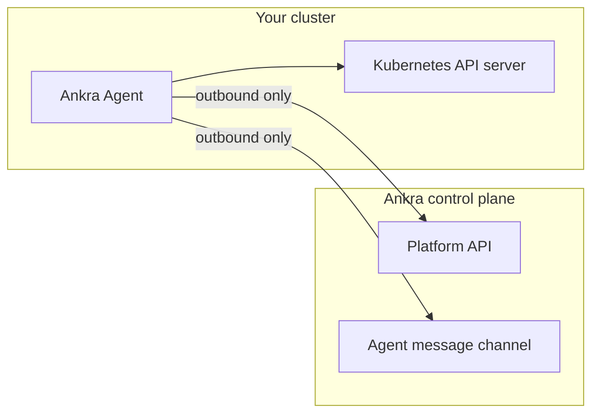

import { YouTube } from "/snippets/youtube.jsx";

Before you connect a cluster, you need to know what Ankra can reach inside it, what it keeps, where that data lives, who can get at it, and how to limit each of those. This page answers those questions in one place. Where the honest answer is "more than you might assume", it says so, and every section links to the page with the detail.

---

## What the agent can do in your cluster

Ankra works in your cluster through the [Ankra Agent](/concepts/cluster-agent), a single pod you install with Helm. The agent's ClusterRole grants **every verb on every resource in every API group**, plus all non-resource URLs, bound cluster-wide. In practice that is cluster-admin. It needs that reach because it installs whatever Helm charts and manifests you choose, keeps them in the state you declared, and carries `kubectl` requests, logs and terminal sessions for the whole cluster. The ClusterRole cannot be narrowed through chart values today.

```mermaid
flowchart LR
    subgraph Cluster["Your cluster"]
        Agent[Ankra Agent]
        KubeAPI[Kubernetes API server]
    end
    subgraph SaaS["Ankra control plane"]
        Platform[Platform API]
        Bus[Agent message channel]
    end
    Agent -->|"outbound only"| Platform
    Agent -->|"outbound only"| Bus
    Agent --> KubeAPI
```

What limits that power:

- **No inbound path.** The agent opens every connection, outbound, to the Ankra platform. Nothing on Ankra's side can connect into your network, and there are no ports to open. [Agent Compliance Posture](/security/agent-compliance#what-crosses-the-boundary) lists the endpoints.
- **A hardened pod.** Non-root, read-only root filesystem, all Linux capabilities dropped, `RuntimeDefault` seccomp, and no host namespaces or host paths.
- **An identity you can cut off from outside.** Each cluster has its own registration token and its own message-channel credentials. Revoking the token at the platform disconnects the agent without needing access to the cluster.
- **Changes go through a reviewable path.** Changes to your stacks are applied from a versioned definition, committed to your Git repository when one is connected. Changes the AI proposes are drafts a person approves, unless your organisation turns on [chat autonomy](/platform/ai-autonomy) for low-risk additive changes.
- **Uninstalling removes it.** `helm uninstall` and deleting the namespace remove the agent, its ServiceAccount and the ClusterRoleBinding.

For a control-by-control review of the agent, including how to record the cluster-admin binding as a justified exception, see [Agent Compliance Posture](/security/agent-compliance). To restrict its network egress and what it watches, see [Hardening the Agent](/security/agent-hardening).

---

## What leaves your cluster

Everything below travels over the agent's outbound connection, except the audit log, which Ankra writes itself when someone acts through the platform. Retention is how long Ankra keeps the data by default.

| Data | When it leaves | Stored by Ankra? | Retention |
|------|----------------|------------------|-----------|
| **Resource inventory** - the Kubernetes objects in the cluster (Deployments, Pods, Services, ConfigMaps, custom resources and so on), plus node and cluster metadata | Continuously, as the agent watches the cluster | Yes. **Secret values are replaced with SHA-256 digests** before they leave; key names remain | No fixed period |
| **Platform metrics** - node, namespace and workload usage for [cluster metrics](/platform/cluster-metrics) | Every 30 seconds, unless the cluster opts out | Yes | 30 days |
| **Pod logs** | Only when someone opens them in the console, the CLI or the AI Assistant | No, streamed to the person viewing them | Not kept |
| **Pod terminal and `exec` sessions** | Only when a member with `kubernetes.exec` opens one | Yes. A recording of what crossed the terminal, including anything the shell printed | Transcript 90 days; who opened it, where and when stays in the audit log |
| **Secret values shown in the console** | When a member opens a Secret in the console | Shown to that member. The stored inventory keeps only the digests | Not kept |
| **Vulnerability findings** - CVE ids, severities, affected images and workloads | When [Trivy Operator](/guides/cluster-security) runs in the cluster (part of the security baseline) | Yes | No fixed period |
| **Software bill of materials** - package names, versions and licences per image | Only on clusters where SBOM generation is turned on (off by default) | Yes | No fixed period |
| **AI chat transcripts** - your questions and whatever cluster data the AI read to answer them | When a member uses the [AI Assistant](/platform/ai-assistant) | Yes, after secret redaction | Until the conversation is deleted |
| **Audit log** - actions taken in Ankra | Written by Ankra, not sent by the agent | Yes | 365 days |

Two things never leave the cluster: **container image contents**, because Trivy scans in-cluster and only its reports are read, and **values decrypted from Git**, because the agent decrypts [SOPS](/guides/sops) values at deploy time and never sends the result back. Your application traffic, volume data and database contents do not pass through the agent either. [Backups](/concepts/backup-vaults) are written straight from the cluster to a bucket you own, not to Ankra.

<Warning>
Anyone who can browse a cluster's resources in Ankra can open a Secret there and read its values. There is no separate permission for it, and the read is not written to the Ankra audit log. Limit it by giving people roles only on the clusters they need (see [How to restrict it](#how-to-restrict-it)), and keep your most sensitive values in an external secret manager rather than in plain Kubernetes Secrets.
</Warning>

---

## Where it lives

**The control plane.** The Ankra platform, its databases, its metrics store, the message channel agents connect to, and its secret store run in the EU, in Finland, with a warm standby in a second data centre in Finland. Database backups are kept in Germany. The providers behind these, and every other sub-processor, are listed at [ankra.ai/trust](https://ankra.ai/trust).

**[Ankra Cloud](/guides/ankra-cloud-kubernetes) clusters (closed beta).** A cluster you run on Ankra Cloud sits on infrastructure the Ankra team operates, so for that cluster Ankra is also your hosting provider. Every other cluster runs on infrastructure and accounts you control.

**Secrets you give Ankra.** Cloud, Git and registry credentials, and AI provider keys, are stored encrypted in a Vault-compatible secret store (OpenBao or HashiCorp Vault) and decrypted only when a provisioning or deployment action needs them. Removing a credential deletes it from the store. For values that live in Git, each organisation has its own [SOPS](/guides/sops) key pair: Git receives only ciphertext, and the private key is delivered only to your clusters. A value you enter in the Stack Builder is held by the control plane as entered, so that Ankra can seal it each time it writes to Git.

**The AI model provider.** When a member uses an AI feature, Ankra sends the question and the cluster data its tools read (resources, events, logs) to a model provider. Detected secret values are redacted from tool results before the model sees them, and the AI's tools read Kubernetes Secrets as key names and counts only. Which provider receives the data is your choice under **AI** → **Settings** → **Models** - see [AI Provider](/platform/ai-provider):

- **Ankra** (the default) - Ankra's own key, routed to third-party model providers.
- **Anthropic** or **OpenRouter** - your own key and your own agreement with that provider.
- **OpenAI-compatible** - any endpoint you run or choose, including a self-hosted model, so model traffic goes only where you point it.

Scheduled AI analysis of your clusters ([AI Insights](/platform/ai-insights)) is off by default. Without it, AI features send data only when a member uses them.

---

## Who can reach it

- **Sign-in.** Members sign in through a managed identity provider (Auth0); Ankra does not store passwords. Federation to your own identity provider is available on the Enterprise plan. See [Identity & Access Controls](/security/identity-and-access).
- **MFA.** Authenticator apps, passkeys and security keys, and recovery codes. An organisation can require MFA for every member. See [Account Security & 2FA](/platform/account-security).
- **Roles.** Five built-in roles - `owner`, `admin`, `operator`, `member` and `viewer` - plus custom roles, each assigned for the whole organisation, one cluster, or a cluster group. The [permission matrix](/guides/roles-and-access#permission-matrix) shows exactly what each role can do.
- **Tokens.** Scripts, CI and MCP clients use API tokens. A token carries its own scopes on top of the role of the member or service account behind it, so it can be narrower than that role but never wider. See [Service Tokens](/guides/service-tokens) and [Tokens](/reference/tokens).
- **Kubernetes access.** `kubectl` access goes through Ankra with short-lived tokens tied to the member, instead of shared kubeconfigs. See [Cluster Access](/guides/cluster-access).

---

## How to restrict it

| To limit | Do this | Where |
|----------|---------|-------|
| What the agent watches and sends | Set `k8s_watch.dynamic_discovery: false` in the agent's Helm values, so it watches only its built-in list of resource types and not every custom resource in the cluster | [Hardening the Agent](/security/agent-hardening#turn-off-optional-egress) |
| Platform metrics | Set `metrics_collect.enabled: false` in the agent's Helm values. The cluster's built-in metrics views then stay empty | [Cluster Metrics](/platform/cluster-metrics) |
| Where the agent can connect | Apply a `NetworkPolicy` that allows the agent's namespace to reach only the Ankra endpoints and your registry | [Hardening the Agent](/security/agent-hardening#restrict-network-egress) |
| Terminal and `exec` access | Keep `kubernetes.exec` out of the roles most people hold. Among the built-in roles only `operator`, `admin` and `owner` have it | [Roles & Access](/guides/roles-and-access#permission-matrix) |
| Reading stored credentials | Keep `credentials.reveal` to the few people who need it. Among the built-in roles only `admin` and `owner` have it | [Roles & Access](/guides/roles-and-access#permission-matrix) |
| Who can browse a cluster, including its Secrets | Assign roles on a cluster or cluster group rather than the whole organisation | [Roles & Access](/guides/roles-and-access#scopes) |
| Which model provider sees cluster data | Switch the AI provider to your own key or your own endpoint | [AI Provider](/platform/ai-provider) |
| Scheduled AI analysis | Leave proactive AI Insights off (the default), or turn AI Insights off for one cluster | [AI Insights](/platform/ai-insights) |
| Package inventories leaving the cluster | Leave SBOM generation off (the default) | [Cluster Security](/guides/cluster-security) |

---

## Evidence and compliance

- [Shared Responsibility](/security/shared-responsibility) - where Ankra's responsibility ends and yours begins, and what that means for a SOC 2 or ISO 27001 scope.
- [Agent Compliance Posture](/security/agent-compliance) - the agent, control by control.
- [Audit Log](/guides/audit-log) and [Audit Export](/security/audit-export) - who did what in Ankra, and how to get the trail out.
- [Compliance Management](/security/compliance-management) - benchmark scores across the fleet, exceptions with owners and review dates, and an evidence report.
- [Cluster Security](/guides/cluster-security) - vulnerability findings across the fleet, ranked by what is being exploited.

<YouTube id="fd4KBfPkMG0" title="Ankra Security Center: fix what is actually exploited" />

To have an organisation's stored data removed when you leave Ankra, and for the offboarding timeline, [contact support](/platform/support).

<Warning>
Take Ankra's own certification status and its sub-processor list from [ankra.ai/trust](https://ankra.ai/trust) or from us directly, not from this documentation. That page is kept current as the programme progresses.
</Warning>

**Next:** if you are reviewing the agent for approval, go to [Agent Compliance Posture](/security/agent-compliance). If you are ready to connect a cluster, start with [Hardening the Agent](/security/agent-hardening) so the restrictions above are in place from the first install.
