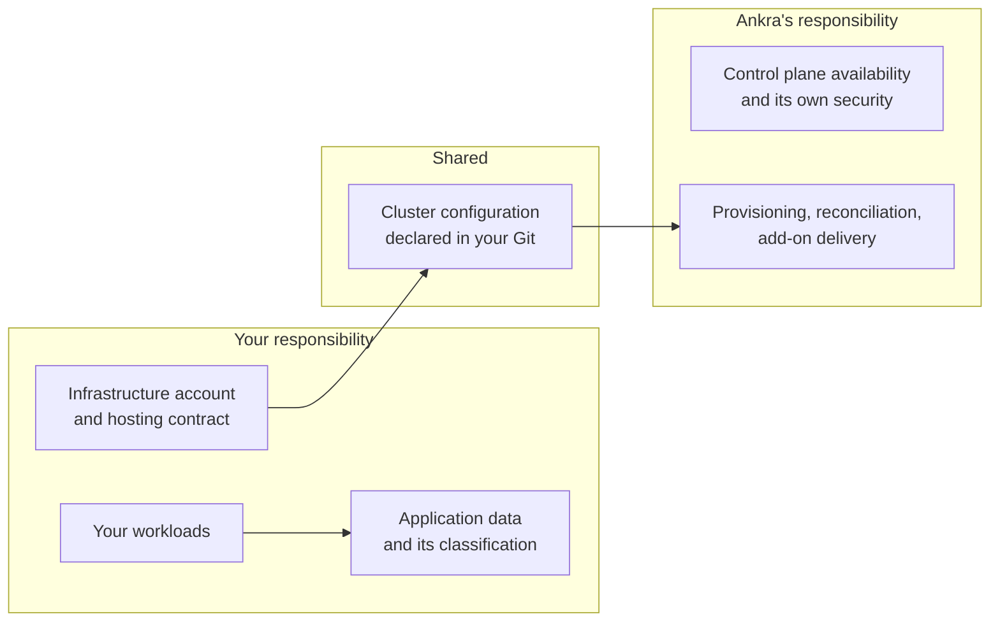

Ankra is a **delivery and management plane**, not a hosting provider. Your clusters run on infrastructure you own or rent, in accounts you hold, under contracts you signed. Ankra provisions, configures and reconciles them - it does not host them, does not sit in the path of your production traffic, and does not store your application data.

That distinction is what keeps Ankra's footprint in your compliance programme small, and it is the first thing to establish with an assessor.

---

## The boundary

| Layer | You | Ankra |
|-------|:---:|:-----:|
| Hosting contract, cloud account, physical and virtual infrastructure | Yes | - |
| Network fabric, firewalls, DNS reachability | Yes | - |
| Your applications and the data inside them | Yes | - |
| Data classification, retention and DLP for your workloads | Yes | - |
| Who you grant access to, and at what scope | Yes | - |
| The desired state you commit to Git | Yes | Reconciled by Ankra |
| Cluster provisioning and lifecycle on your infrastructure | - | Yes |
| Add-on and Stack delivery, drift correction | - | Yes |
| The cluster agent and its behaviour | - | Yes |
| Ankra control plane security, availability and its own ISMS | - | Yes |
| Incident response for the Ankra platform | - | Yes |
| Incident response for your workloads | Yes | - |

<Note>
For fully self-hosted deployments the split shifts further toward you, because the control plane itself runs on your infrastructure. Talk to us about the on-premise specification if that is your requirement.
</Note>

---

## What this means for your certification

The common assumption is that adding a platform vendor drags a large new area into audit scope. For Ankra that is not the case, for three specific reasons.

### Ankra is not your hosting sub-service organisation

Your cloud or hosting provider remains the sub-service organisation for infrastructure controls - physical security, environmental controls, hypervisor isolation, hardware disposal. Ankra does not replace them, does not sit underneath them, and does not inherit their control set. Adding Ankra does not change which infrastructure provider your assessor examines, and does not add a second one.

Ankra enters your programme as a **supplier providing a management service**, assessed the same way you would assess a CI/CD vendor or an infrastructure-as-code tool.

### Ankra is not in your data path

The agent is a control-plane client, not a proxy or sidecar. It does not terminate your application traffic, mount your application volumes, or connect to your databases. Your regulated data does not flow through Ankra, which keeps Ankra out of the control families that govern data processing, residency and transfer for that data.

What Ankra does hold is described precisely in [Data Handling](/security/data-handling): cluster and workload **metadata**, credentials you deliberately store, audit events, and AI chat transcripts.

### Ankra is not in your availability path

If the Ankra control plane is unreachable, your clusters keep running and keep serving traffic. Workloads are unaffected, the Kubernetes control plane is unaffected, and the agent buffers what it cannot send and replays it when the connection recovers. What pauses is reconciliation and platform visibility, not your service.

This matters for availability-related criteria: an Ankra outage is a **management** outage, not a production one, and it does not belong in the same category as your hosting provider going down.

---

## Where Ankra appears in your audit

Rather than a broad scope expansion, expect Ankra to surface at these specific points.

| Control area | How Ankra appears | Evidence to point at |
|--------------|-------------------|----------------------|
| Supplier and third-party risk | A supplier providing cluster management. Assess as a vendor. | Your supplier register entry, plus Ankra's published posture |
| Privileged access | The agent's cluster-admin ServiceAccount, and platform roles held by your staff | [Agent Compliance Posture](/security/agent-compliance), [Roles & Access](/guides/roles-and-access) |
| Change management | Cluster changes as attributed Git commits, plus platform actions in the audit log | [GitOps](/concepts/gitops), [Audit Export](/security/audit-export) |
| Logging and monitoring | The organisation audit trail and its retention | [Audit Export](/security/audit-export) |
| Access control and authentication | SSO, enforced MFA, scoped roles | [Identity & Access Controls](/security/identity-and-access) |
| Configuration and vulnerability management | Benchmark results and policy state per cluster | [Compliance Management](/security/compliance-management) |
| Data transfer | Metadata sent to the control plane, under a processing agreement | [Data Handling](/security/data-handling) |

<Tip>
Most SOC 2 reports treat a management vendor like Ankra under the **carve-out method** - the vendor's controls are excluded from the report and handled through vendor management instead. That is usually the right choice here, and it is the least work for you.
</Tip>

---

## What Ankra does not do for your compliance

Being explicit about the limits is more useful than a long list of claims.

- **Ankra does not certify your environment.** The platform produces evidence about your clusters. An assessor still decides whether your controls are effective.
- **Ankra does not make your workloads compliant.** Application-layer controls, data handling inside your services, and your own SDLC remain yours.
- **Ankra does not replace your hosting provider's attestations.** You still collect those separately.
- **Ankra is not a substitute for your ISMS.** The platform is one control among many, and the compliance report is input to your programme, not the programme itself.
- **Using Ankra does not by itself satisfy any control.** It gives you the mechanism and the evidence; you still need the policy and the review cadence around them.

---

## Ankra's own security programme

Ankra runs its own information security management system, and the honest status of that work - certifications held, controls implemented, and what is still in progress - is published and kept current at [ankra.ai/trust](https://ankra.ai/trust). Sub-processors and hosting providers are listed there too.

<Warning>
Do not treat this documentation as an attestation of Ankra's certification status. Where your procurement process needs a current statement, take it from [ankra.ai/trust](https://ankra.ai/trust) or ask us directly - that page is the single source of truth and it changes as the programme progresses.
</Warning>

---

## Related

<CardGroup cols={2}>
  <Card title="Security at Ankra" icon="shield-halved" href="/security/overview">
    The trust model this responsibility split sits inside.
  </Card>
  <Card title="Agent Compliance Posture" icon="clipboard-check" href="/security/agent-compliance">
    Control-by-control scope determination for the cluster agent.
  </Card>
  <Card title="Data Handling" icon="database" href="/security/data-handling">
    Exactly what the control plane stores.
  </Card>
  <Card title="Compliance Management" icon="file-shield" href="/security/compliance-management">
    Generate the evidence an assessor asks for.
  </Card>
</CardGroup>
